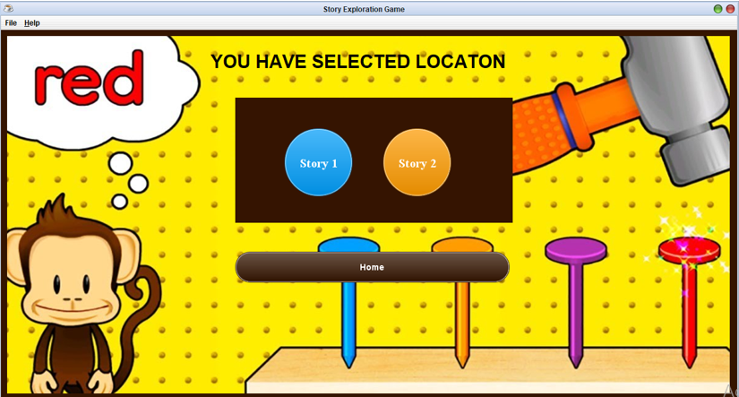

# Story-Exploration-Game_2
The local educational company Fun2Learn looking to move into the sector of edutainment software. The purpose of this assignment is to develop a game about choose your own adventure application which will help children to appreciate the locations and characters of works of great fictions. The game will have some passages in text format along with a series of possible choices. The choices might make based on the passages. After making a choice, the users are taken to the different passage of a story and given a range of other choices. I have also asked to develop some features of this application which can save their game state and also restore one module as the user want. 
   

